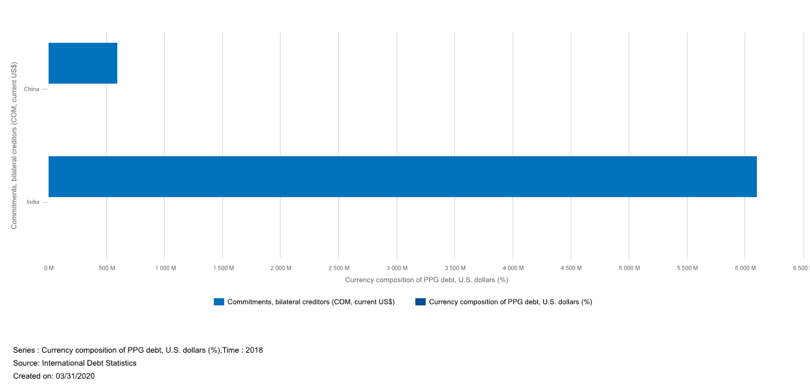

# Phase 1 Report

The Great Recession was a period of marked general decline observed in national economies globally during the late 2000s and early 2010s.

We are living in times of recession which might be greater than that of 2007-2010 Great Recession. We are seeing falling inflows in low and middle income countries. This is particularly highlighted in the 2018, where the total inflows of the low and middle income countries fell by 19%. China, the largest borrower in this category also observed a 4% decline in the inflows. China which received over 42 percent of the net financial flows to low- and middle-income countries in 2017–18, a reflection, in part, of China’s efforts to open its domestic bond and stock markets, and of the Morgan Stanley Capital Investment’s (MSCI’s) decision to include Chinese stocks in its benchmark indexes.

The increase in external debt stocks was dominated by China, which accounted for one quarter of the combined end-2018 external debt stocks of low- and middle-income countries. China’s external debt stock rose 15 percent in 2018; short-term debt increased by 18 percent, and long-term debt by 9 percent.

We want to analyse the debts the countries have taken and how it affects various factors(social, economical and financial). We will be using various plots and data visualisation techniques to uncover various patterns and anomalies from the data. The current scenario can also be predicted using the analysis we do which can be used as model for such task. Which countries have used the debt in what manners and have their socio-economic indicators have become better.  We also want to group these countries on various basis such as major religion , date of independence, kind of government they have.

We would also be comparing the inflows of these countries during the periods of depression.

For some perspective, we have also explored the World Bank data comparing Net Financial flows and commitments during different periods.

2018 Bilateral Commitments, China and India

India Bilateral Commitments during the Great Recession decreased and then finally increased by the end of the recession

.png)

Commitments vs Net flow during the Great Depression

.png)

Commitments Compared to Net financial flows in the previous government

.png)

Commitments vs Net flow during 2017

.png)

Commitments vs Net flow during 2018

.png)

We can here also observe that China is pretty much developed seeing the low and relatively consistent commitments. Brazil's economy can be seen relatively weaker seeing the trend.

We believe that there are four ways of data visualisation.

1. Explore - here we will let the user find out answer to variou kind of question.
2. Explain - We will explain the reason and provide context about why things happen a given way.
3. Show - just show the boring data in a very appealing and easy to understand way.
4. Expose -show the data in a way we receive , this helps in getting an insight about what we are trying to understand.

We will be using the these approaches to explore more dimensions of data than those just *shown* here.

We will try to divide our data visualisation task into four different sub-tasks, each of which has its own importance.

We will also try to compare the performance of nations as groups such as BRICS and SAARC and G20.